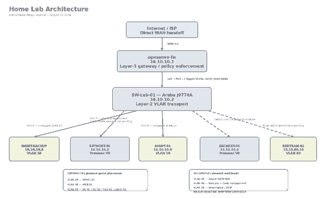

# Diagrams

Completed repository diagrams:

- [`home-lab-architecture.png`](home-lab-architecture.png) — physical/logical overview from the Internet/ISP through OPNsense and SW-Lab-01 to management systems, Proxmox hosts, VLANs, and planned workloads.
- [`vlan-topology.png`](vlan-topology.png) — authoritative VLAN IDs, subnets, gateways, named systems, workload placement, and security purpose.
- [`security-telemetry-flow.png`](security-telemetry-flow.png) — approved Wazuh host-telemetry flow, Aruba mirror/SPAN path to Suricata/Zeek, and Velociraptor investigation/collection flow, with planned integrations clearly marked as pending verification.

## Home Lab Architecture

## Logical VLAN Topology

## Security Telemetry Flow

## Authoritative Basis

The diagrams are based primarily on `Home-Lab-Network-Topology-final-2026-08-20.pdf`, with addressing and workload details cross-checked against `Authoritative-VLAN-Designations-final-2026-08-20.txt`, `Home-Lab-Hardware-Inventory-final-2026-08-20.pdf`, and `OPNsense-Phases-3-12-Home-Lab-Configuration-final-2026-08-20.pdf`.

Planned components, VLAN-aware guest trunks, security telemetry integrations, and SPAN/mirror paths are intentionally shown as planned/pending until live deployment and verification are complete.
